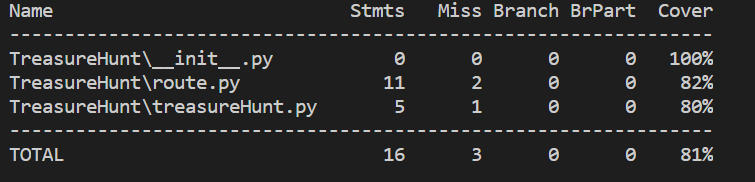

# Flask开发入门

## 安装依赖

```powershell
pip install Flask
pip install pymongo
pip install pytest
pip install coverage
```

## 启动flask web服务器

- 在终端输入如下命令启动服务器

  ```
  python app.py
  ```

- 启动后，可以使用任何web客户端和浏览器测试服务，推荐使用[Postman](https://www.getpostman.com/)进行测试
    

## Test and Coverage

在完成所有功能开发后，利用[pytest](http://www.pytest.org/en/latest/)和[coverage](https://coverage.readthedocs.io/en/v4.5.x/)测试和评估代码，在终端顺序输入如下命令：

- 执行单元测试
  
    ```
    pytest
    ```

- 覆盖率测试:

    ```
    coverage run -m pytest
    ```


- 报告覆盖率:

    ```
    coverage report
    ```
- 显示覆盖率报告:

