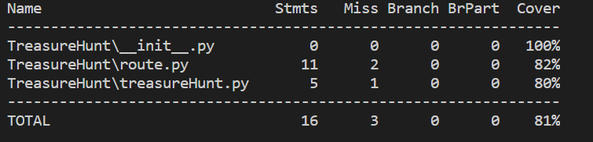

# 使用Flask开发一个JSON Web服务

## 安装依赖

```powershell
pip install Flask
pip install pymongo
pip install pytest
pip install coverage
```

## 启动flask web服务器

```powershell
python app.py
```

输入如下：

> \* Serving Flask app "app" (lazy loading) <br>
> \* Environment: production <br>
   WARNING: This is a development server. Do not use it in a production deployment. <br>
   Use a production WSGI server instead. <br>
> \* Debug mode: off <br>
> \* Running on http://127.0.0.1:5000/ (Press CTRL+C to quit) <br>


启动后，可以使用任何web客户端和浏览器测试服务，推荐使用[Postman](https://www.getpostman.com/)进行测试

    curl -L 'http://127.0.0.1:5000/cal/add/10/30'

显示JSON格式响应
    
> {"ok":true,"result":40}

## Test and Coverage

在完成所有功能开发后，利用[pytest](http://www.pytest.org/en/latest/)和[coverage](https://coverage.readthedocs.io/en/v4.5.x/)测试和评估代码

- 执行单元测试
    pytest

覆盖率测试:

    coverage run -m pytest

报告覆盖率:

    coverage report

显示覆盖率报告:

